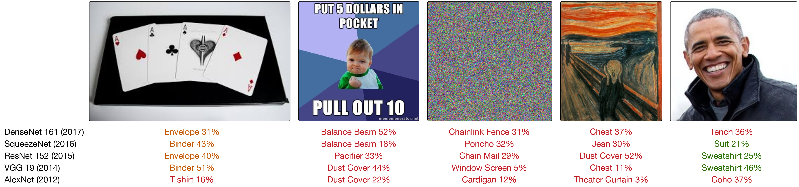
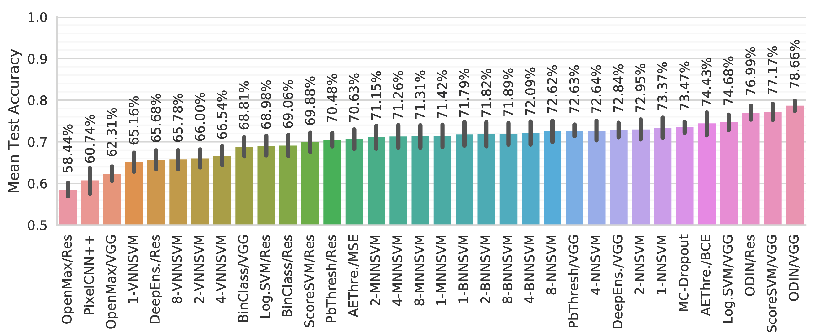

# Publication Information
This repository accompanies the paper:

- A. Shafaei, J. J. Little, Mark Schmidt. A Less Biased Evaluation of Out-of-distribution Sample Detectors. in _BMVC_ 2019.
- "Does Your Model Know the Digit 6 Is Not a Cat? A Less Biased Evaluation of Outlier Detectors." [[ArXiv](https://arxiv.org/abs/1809.04729)].

Keywords: out-of-distribution sample detection, outlier detection, anomaly detection, deep neural networks.

**Bibtex**:
```bibtex
@inproceedings{Shafaei2019,
    title={A Less Biased Evaluation of Out-of-distribution Sample Detectors},
    author={Alireza Shafaei, Mark Schmidt and James Little},
    year={2019},
    booktitle={Proceedings of the British Machine Vision Conference (BMVC)},
    publisher={BMVA Press},
}
```

* **Raw Results** with a list of experiments: [[Google Sheets](https://docs.google.com/spreadsheets/d/1OgDgxngBgDZyQ22FX85fA6tsu2ke8yuCz--IrjhSiYE/edit?usp=sharing)]
* **Experiment Files**: Get the pretrained models [[Document](docs/pretrained.md)]

# Introduction


The problem of interest is out-of-distribution (OOD) sample detection. In our paper, we present an evaluation framework called OD-test for methods that address OOD sample detection. We show that the traditional evaluation strategy yields overly-optimistic results, hence the need for more reliable evaluation. In this repository, we implement the OD-test for image recognition problems with deep neural networks. You can replicate all the results of our paper here.

The OOD detection problem arises in settings where the input of the neural network in a deployed system is not guaranteed to follow a fixed distribution. OOD inputs can lead to unpredictable behaviour in neural network pipelines. For instance, the neural network might be trained to recognize the MNIST digits, but then when deployed, it might encounter a natural image which it has never seen. Counter-intuitively, the trained neural networks often fail silently and make over-confident predictions on previously unseen input. We need to develop methods that detect OOD samples to prevent unpredictable behaviour. Unfortunately, we cannot filter out these problematic instances by thresholding the output probability of the most likely class. In the above image, we show the output of several popular CNNs trained on ImageNet but tested on random benign images that do not belong to ImageNet.

The code in this repository allows

1. Painless replication of all the results in the paper. You can run from scratch or use the pretrained models.
2. Easy method development and testing for future work.
3. Quickly adding more datasets for evaluation.

I have spent a long time refining this code. The final result is a modularized codebase that is reasonably efficient. I recommend that you take the time to understand the general architecture of the project before making substantial changes. I welcome pull-requests. In particular, if you wish to add a new method to the evaluation or improve a part of the code. You can ask questions in [Issues](https://github.com/ashafaei/OD-test/issues).

## What is next?

- First step: [setting up the project](#setup).
- Replicating all the results of the paper.
    - Training the *reference models* with an explanation of the training mechanics [here](docs/train_reference_models.md).
    - Get the pretrained models [here](docs/pretrained.md).
    - Running the evaluations with a quick example [here](docs/eval3d.md).
- Learn about the code organization [here](docs/code_organization.md).
- How to add
    - A new network architecture [here](docs/new.md#architecture).
    - A new dataset for evaluation [here](docs/new.md#dataset).
    - A new method for evaluation [here](docs/new.md#method).

## List of the Datasets

| Index | Name          | Train     | Valid     | Test      | Input Dim         | #Classes  | D1?   |
|-------|---------------|-----------|-----------|-----------|-------------------|-----------|-------|
| 1     | MNIST         | (50,000   | 10,000)   | 10,000    | 28x28 = 784       | 10        | :heavy_check_mark:     |
| 2     | FashionMNIST  | (50,000   | 10,000)   | 10,000    | 28x28 = 784       | 10        | :heavy_check_mark:     |
| 3     | NotMNIST      |           |           |           | 28x28 = 784       | 10        | :x:     |
| 4     | CIFAR 10      | (40,000   | 10,000)   | 10,000    | 3x32x32 = 3,072   | 10        | :heavy_check_mark:     |
| 5     | CIFAR 100     | (40,000   | 10,000)   | 10,000    | 3x32x32 = 3,072   | 100       | :heavy_check_mark:     |
| 6     | TinyImagenet  | 100,000   | 10,000    | 10,000    | 3x64x64 = 12,288  | 200       | :heavy_check_mark:     |
| 7     | STL10         | 5,000     | (4,000    | 4,000)    | 3x96x96 = 27,648  | 10        | :heavy_check_mark:     |
| 8     | U(0,1)        |           |           |           | flexible          |           | :x:     |
| 9     | N(mu=0.5, sigma=0.25)|    |           |           | flexible          |           | :x:     |

## List of Implemented Methods

| Index | Name          | Short Description                                                                    | Code |
|-------|---------------|--------------------------------------------------------------------------------------|------|
| 1     | PbThreshold [1]   | A threshold on the maximum probability.                                              | [link](methods/base_threshold.py) |
| 2     | ScoreSVM      | A SVM on the logits (pre-softmax).                                                   | [link](methods/score_svm.py) |
| 3     | LogisticSVM   | A SVM on the logits of a network trained with k-way logistic loss function.          | [link](methods/logistic_threshold.py) | 
| 4     | MCDropout [2]     | MC-Dropout evaluation over 7 samples followed by a threshold on the entropy of average prediction.   | [link](methods/mcdropout.py) | 
| 5     | KNNSVM        | An SVM on the sorted Euclidean distance to K-nearest-neighbours.                     | [link](methods/nearest_neighbor.py) |
| 6     | ODIN [3]          | A threshold on the scaled softmax outputs of the perturbed input.                    | [link](methods/odin.py) |
| 7     | AEThreshold   | A threshold on the autoencoder reconstruction error of the given input.              | [link](methods/reconstruction_error.py) |
| 8     | DeepEnsemble [4]  | Similar to MCDropout, except we average over the predictions of 5 networks that are trained independently with adversarial data augmentation.| [link](methods/deep_ensemble.py) | 
| 9     | PixelCNN++ [5]    | A threshold on the log-likelihood of each input.                                     | [link](methods/pixelcnn.py) |
| 10    | OpenMax [6]       | Calibrated probability with additional unknown class and an SVM on top.              | [link](methods/openmax.py) |
| 11    | K-MNNSVM, K-BNNSVM, K-VNNSVM | Similar to KNNSVM, but uses the latent representation of different (variational)-autoencoders. | [link](methods/nearest_neighbor.py) |

## Average Performance (Sept. 13, 2018)



# Setup
This project has been tested on:

- Ubuntu 16.
- CUDA 9.1, CudNN 7.
- Python 2.7 + Virtual Env.
- Titan X, Titan XP.
- PyTorch 0.4

We recommend installing Anaconda with Python 2.7 and Virtual Env.

Depending on the experiment being run, you may need up to 12 GBs of GPU memory. A single GPU suffices to run all the experiments.

## Setting up the Environment

The setup script creates a `workspace` folder within which all the subsequent project files will be put. To get started, you must first run the setup script.

```bash
> cd <root_folder>
> python setup/setup.py
```

The setup script will create a virtual environment at `workspace/env` and will install the required packages from [requirements.txt](setup/requirements.txt). After a successful setup, you can activate the environment using:

```bash
source workspace/env/bin/activate
```

_You must run all the scripts within the generated environment_.

## Visualization

In this project we use `visdom` for visualization mid-training. We use `seaborn` to generate the figures in the paper. I wrote this code assuming that visdom is available for visualization at first. I then rewrote the code to make it functional without `visdom` as well. However, some parts of the code may still require `visdom` to be accessible. To be on the safe side, I recommend having `visdom` in the background just in case until I make sure the entire project would function correctly without `visdom` as well. (pull request to resolve this issue are welcomed!)

In a new terminal tab run this:
```bash
> cd <root_folder>
> bash launch_visdom.sh
```

If you execute the code on a remote server, but you want to run `visdom` on your local machine, you can do a remote (reverse) port forwarding for port `8097` to your machine with SSH like this:

```bash
# Run this from the local machine to connect to the remote machine which will execute the scripts.
ssh -R 8097:localhost:8097 user@remote-machine
```

With this you can have a single `visdom` running locally, but having multiple machines reporting to the same `visdom`.

# References

1. D. Hendrycks and K. Gimpel, “A Baseline for Detecting Misclassified and Out-of-Distribution Examples in Neural Networks,” ICLR, 2017.
2. Y. Gal and Z. Ghahramani, “Dropout as a Bayesian Approximation: Representing Model Uncertainty in Deep Learning,” in ICML, 2016.
3. S. Liang, Y. Li, and R. Srikant, “Enhancing The Reliability of Out-of-distribution Image Detection in Neural Networks,” ICLR, 2018.
4. B. Lakshminarayanan, A. Pritzel, and C. Blundell, “Simple and Scalable Predictive Uncertainty Estimation using Deep Ensembles,” in NIPS, 2017.
5. T. Salimans, A. Karpathy, X. Chen, and D. P. Kingma, “Pixelcnn++: Improving the pixelcnn with discretized logistic mixture likelihood and other modifications,” ICLR, 2017.
6. A. Bendale and T. E. Boult, “Towards Open Set Deep Networks,” in CVPR, 2016.
